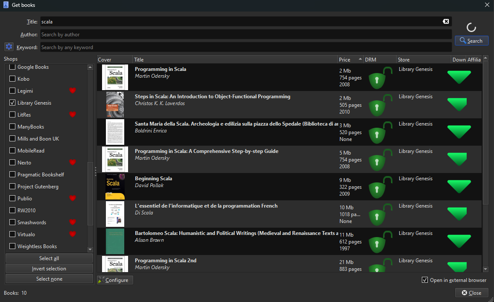

# LibGen Calibre Store Plugin
This is a plugin for Calibre which allows you to search LibGen sites for books using Calibre.

### The current LibGen sites are:
- libgen.rs
- libgen.is
- libgen.st

### Installation
1. Download the zip file from the releases page.
2. Open Calibre.
3. Go to Preferences -> Plugins -> Load Plugin from File and select the zip file you downloaded.
4. Restart Calibre.
5. Make sure the store "Library Genesis" is enabled under Get Books -> Shops.

#### Tips
Calibre defaults to a maximum of 10 results returned at a time. You can change this maximum at Get Books -> Configure -> Configure Search -> Maximum number of results...
